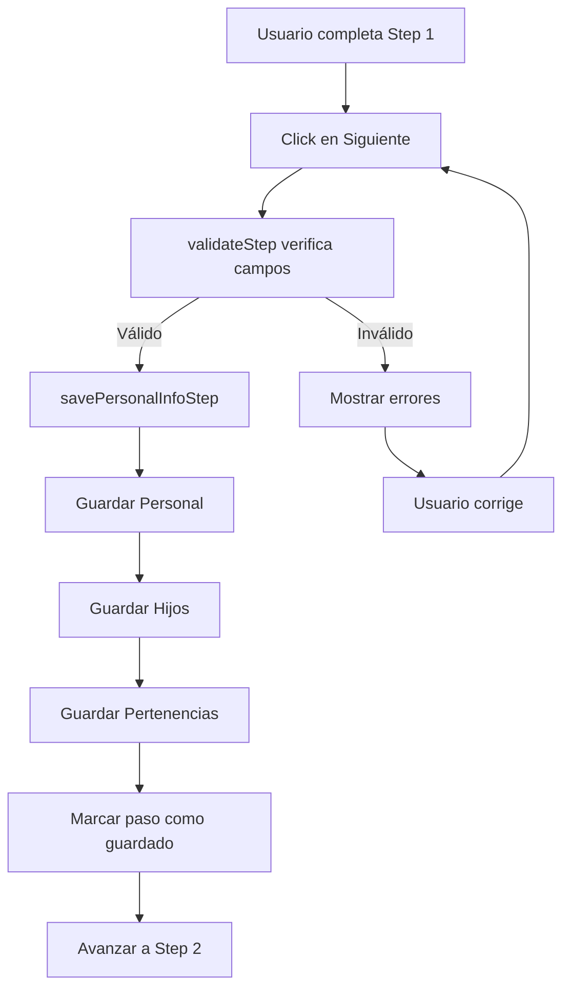

# Implementación: PersonalInfoStep con Guardado Secuencial

## 📋 Resumen

Se implementó el guardado secuencial en el **Step 1 (PersonalInfoStep)** siguiendo el mismo patrón que BasicInfoStep. Los datos de información personal, hijos y pertenencias se guardan automáticamente en el backend antes de avanzar al siguiente paso.

## ✨ Cambios Implementados

### 1. **Hook `usePrisonerFormHandler.ts`**

#### Imports añadidos:
```typescript
import { personalService } from '../../../../shared/services/personalService';
import { childrenService } from '../../../../shared/services/childrenService';
import { belongingsService } from '../../../../shared/services/belongingsService';
```

#### Nueva función `savePersonalInfoStep`:
- Guarda información personal usando `personalService.createPersonal()`
- Guarda cada hijo usando `childrenService.createChild()`
- Guarda cada pertenencia usando `belongingsService.createBelonging()`
- Maneja errores individualmente sin bloquear todo el proceso
- Marca el paso como guardado en `formState.savedSteps`

#### Validación del Step 1:
Se añadió validación completa en `validateStep` para:
- Campos requeridos de información personal (estado civil, educación, género, ocupación)
- Validación de cada hijo (nombre y fecha de nacimiento)
- Validación de cada pertenencia (descripción y cantidad)

#### Integración en `handleNext`:
```typescript
if (activeStep === 1) {
  const result = await savePersonalInfoStep();
  
  if (!result.success) {
    return; // No avanzar si falla el guardado
  }
}
```

### 2. **Componente `PersonalInfoStep.tsx`**

#### Optimizaciones aplicadas:

✅ **React.memo** para evitar re-renders innecesarios
```typescript
export const PersonalInfoStep: React.FC<PersonalInfoStepProps> = React.memo(({
  data,
  onUpdate,
  errors = {},
}) => {
  // ...
});
```

✅ **useMemo** para memoizar datos
```typescript
const personal = useMemo(() => data.personal || {}, [data.personal]);
const belongings = useMemo(() => data.belongings || [], [data.belongings]);
const children = useMemo(() => data.child || [], [data.child]);
const childFields = useMemo(() => [...], []);
```

✅ **useCallback** para handlers
```typescript
const handlePersonalChange = useCallback((field, value) => {
  onUpdate({
    personal: { ...personal, [field]: value },
    belongings: data.belongings,
    child: data.child,
  });
}, [onUpdate, personal, data.belongings, data.child]);
```

✅ **Debounce en todos los inputs** para evitar lentitud

### 3. **Componente `BelongingsListForm.tsx`**

Se añadió `debounce={true}` a todos los TextInputField:
- Descripción
- Cantidad
- Condición

### 4. **Componente `DynamicListForm.tsx`**

Se reemplazó `TextInput` de Mantine por `TextInputField` con debounce:
```typescript
import { TextInputField } from './TextInputField';

// En el render:
<TextInputField
  // ...props
  debounce={true}
/>
```

### 5. **Tipos actualizados**

En `prisonerTypes.ts` se cambió:
```typescript
// Antes:
belonging?: Partial<Belonging>;

// Después:
belongings?: Partial<Belonging>[]; // Array plural
```

## 🔄 Flujo de Guardado



## 📊 Datos Guardados

### Información Personal
```typescript
{
  gender: "Masculino" | "Femenino" | "Otro",
  father_name: string,
  mother_name: string,
  education_level: string,
  occupation: string,
  marital_status: "Soltero" | "Casado" | "Viudo" | "Divorciado",
  observations?: string
}
```

### Hijos
```typescript
{
  full_name: string,
  birth_date?: string
}
```

### Pertenencias
```typescript
{
  description: string,
  quantity: number,
  condition?: string,
  returned: boolean
}
```

## ✅ Validaciones Implementadas

### Campos Requeridos - Personal
- ✅ Estado civil
- ✅ Nivel de educación
- ✅ Género
- ✅ Ocupación

### Campos Requeridos - Hijos
- ✅ Nombre completo
- ✅ Fecha de nacimiento

### Campos Requeridos - Pertenencias
- ✅ Descripción
- ✅ Cantidad (> 0)

## 🎯 Manejo de Errores

### Estrategia Implementada:
1. **Errores personales**: Se muestran con notificación naranja pero no bloquean
2. **Errores de hijos/pertenencias**: Se muestran individualmente sin detener el proceso
3. **Errores críticos**: Se muestran en rojo y detienen el avance

### Notificaciones:
- ✅ Verde: Operación exitosa
- ⚠️ Naranja: Error no crítico (se puede continuar)
- ❌ Rojo: Error crítico (bloquea avance)

## 🚀 Mejoras de Rendimiento

### Antes:
- ❌ Re-render completo en cada keystroke
- ❌ Inputs lentos al escribir
- ❌ Sin memoización
- ❌ Callbacks recreados en cada render

### Después:
- ✅ Debounce de 300ms en inputs
- ✅ Escritura fluida e instantánea
- ✅ Memoización con useMemo
- ✅ Callbacks estables con useCallback
- ✅ React.memo en componente principal

## 📝 Ejemplo de Uso

```typescript
<PersonalInfoStep
  data={{
    personal: formData.personal,
    belongings: formData.belongings,
    child: formData.child,
  }}
  onUpdate={handleDataUpdate}
  errors={errors}
/>
```

## 🔧 Configuración de Servicios

Los servicios ya estaban implementados:
- ✅ `personalService` → `/prisoners/{id}/personal`
- ✅ `childrenService` → `/prisoners/{id}/children`
- ✅ `belongingsService` → `/prisoners/{id}/belongings`

## 📦 Dependencias

No se requieren nuevas dependencias. Se utilizaron las existentes:
- `@mantine/core`
- `@mantine/notifications`
- React hooks (`useState`, `useCallback`, `useMemo`, `memo`)

## 🧪 Testing Recomendado

1. **Flujo completo**:
   - Crear prisionero en Step 0
   - Completar Step 1 con personal, hijos y pertenencias
   - Verificar que se guarda correctamente
   - Avanzar a Step 2

2. **Validaciones**:
   - Intentar avanzar sin completar campos requeridos
   - Verificar mensajes de error

3. **Rendimiento**:
   - Escribir rápidamente en los inputs
   - Verificar que no hay lag

4. **Manejo de errores**:
   - Simular error en el backend
   - Verificar que se muestran las notificaciones correctas

## 🔄 Próximos Pasos

Para implementar el guardado en otros steps:

1. Crear función `save{StepName}Step` en el hook
2. Añadir validación en `validateStep`
3. Llamar la función en `handleNext`
4. Optimizar el componente con memo, useMemo y useCallback
5. Añadir debounce a los inputs

## 📚 Referencias

- Patrón base: `BasicInfoStep.tsx`
- Hook principal: `usePrisonerFormHandler.ts`
- Servicios: `personalService`, `childrenService`, `belongingsService`
- Optimización de inputs: `SOLUCION_LENTITUD_INPUTS.md`
