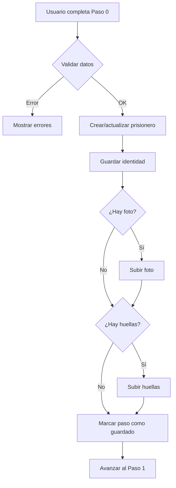

# 📝 Resumen de Implementación - Guardado Progresivo

## ✅ IMPLEMENTACIÓN COMPLETADA

Se ha implementado con éxito el sistema de **guardado progresivo** para el formulario de registro de prisioneros.

---

## 🎯 Características Implementadas

### 1. **Guardado Automático por Paso**
- ✅ El formulario guarda automáticamente al avanzar de paso
- ✅ No se permite avanzar si hay errores de validación
- ✅ Los datos se guardan en el backend antes de continuar
- ✅ Notificaciones visuales para cada acción

### 2. **Modo Creación y Edición**
- ✅ **Modo Creación**: Crea el prisionero progresivamente
- ✅ **Modo Edición**: Actualiza solo los datos modificados
- ✅ ID del prisionero se mantiene durante todo el proceso

### 3. **Paso 0 - Información Básica (IMPLEMENTADO)**
El primer paso guarda en secuencia:
1. **Datos básicos del prisionero** → `POST /prisoners`
2. **Datos de identidad** → `POST /prisoners/{id}/identity`
3. **Foto de perfil** → `POST /prisoners/{id}/identity/upload-photo`
4. **Huella dactilar derecha** → `POST /prisoners/{id}/identity/upload-fingerprint`
5. **Huella dactilar izquierda** → `POST /prisoners/{id}/identity/upload-fingerprint`

---

## 📁 Archivos Modificados

### 1. **usePrisonerFormHandler.ts** (Principal)
**Cambios:**
- ✅ Agregado estado `FormState` con `prisonerId` y archivos temporales
- ✅ Función `validateStep(step)` para validar cada paso
- ✅ Función `saveBasicInfoStep()` con toda la lógica de guardado
- ✅ Handler `handleFileUpdate()` para archivos temporales
- ✅ `handleNext()` actualizado para guardar antes de avanzar
- ✅ Manejo completo de errores con notificaciones
- ✅ Props extendidas: `mode`, `prisonerId`, `onFileUpdate`

**Nuevas exportaciones:**
```typescript
{
  prisonerId: string | undefined;
  savedSteps: Set<number>;
  handleFileUpdate: (fileType, file) => void;
}
```

### 2. **PrisonerFormWizard.tsx**
**Cambios:**
- ✅ Agregada prop `prisonerId?: string` para modo edición
- ✅ Pasa `handleFileUpdate` al `BasicInfoStep`
- ✅ Mantiene el estado del wizard limpio

**Props actualizadas:**
```typescript
interface PrisonerFormWizardProps {
  mode?: "create" | "edit";
  prisonerId?: string;  // ⬅️ NUEVO
  initialData?: Partial<CreatePrisonerData>;
  onSuccess?: (result: { prisoner: PrisonerBase; id: string }) => void;
  onCancel?: () => void;
}
```

### 3. **BasicInfoStep.tsx**
**Cambios:**
- ✅ Agregada prop `onFileUpdate` para manejar archivos
- ✅ Los dropzones guardan archivos Y preview
- ✅ Conversión automática de fechas (string ↔ Date)
- ✅ Interface simplificada usando `Partial<CreatePrisonerData>`

**Nueva prop:**
```typescript
onFileUpdate?: (fileType: 'photo' | 'fingerprintLeft' | 'fingerprintRight', file: File) => void;
```

### 4. **prisonerTypes.ts**
**Cambios:**
- ✅ Extendida interface `CreatePrisonerData` con todos los campos de los pasos
- ✅ Agregados tipos para:
  - `identity` (con archivos)
  - `personal`, `belonging`, `child`
  - `medical_record`
  - `penitentiary`
  - `contacts`
  - `legal`

**Estructura actualizada:**
```typescript
export interface CreatePrisonerData {
  // Paso 0
  registration_number: string;
  admission_date: string;
  fiscal_file_number?: string;
  status?: string;
  identity?: { ... };
  
  // Paso 1
  personal?: Partial<Personal>;
  belonging?: Partial<Belonging>;
  child?: Partial<Child>[];
  
  // Paso 2
  medical_record?: Partial<MedicalRecord>[];
  
  // Paso 3
  penitentiary?: Partial<Penitentiary>;
  
  // Paso 4
  contacts?: Partial<Contact>[];
  
  // Paso 5
  legal?: { ... };
}
```

### 5. **BelongingDropzone.tsx** (Fix)
**Cambios:**
- ✅ Corregido tipo de archivo: `files[0] as File`
- ✅ Elimina error de TypeScript con `FileWithPath`

---

## 🔄 Flujo de Guardado (Paso 0)



---

## 🧪 Cómo Usar

### Modo Creación
```tsx
<PrisonerFormWizard
  mode="create"
  onSuccess={(result) => {
    console.log('Prisionero creado:', result.id);
    navigate(`/prisoners/${result.id}`);
  }}
  onCancel={() => navigate('/prisoners')}
/>
```

### Modo Edición
```tsx
<PrisonerFormWizard
  mode="edit"
  prisonerId={id}
  initialData={loadedData}
  onSuccess={(result) => {
    console.log('Prisionero actualizado:', result.id);
    navigate(`/prisoners/${result.id}`);
  }}
  onCancel={() => navigate('/prisoners')}
/>
```

---

## 🎨 Validaciones Implementadas (Paso 0)

### Datos Básicos
- ✅ `registration_number` - Requerido
- ✅ `admission_date` - Requerido
- ✅ `fiscal_file_number` - Requerido

### Datos de Identidad
- ✅ `surname` - Requerido
- ✅ `first_name` - Requerido
- ✅ `birth_date` - Requerido
- ✅ `birth_place` - Requerido
- ✅ `residence` - Requerido
- ✅ `citizenship_type` - Requerido
- ✅ `country_of_origin` - Requerido
- ✅ `nationality` - Requerido
- ✅ `nationality_type` - Requerido

### Archivos
- ⚠️ `photo` - Opcional (pero recomendado)
- ⚠️ `fingerprint_left` - Opcional
- ⚠️ `fingerprint_right` - Opcional

---

## 📦 Servicios Utilizados

### ✅ Implementados y funcionando:
- `prisonersService.createPrisoner(data)`
- `prisonersService.updatePrisoner(id, data)`
- `identityService.createIdentity(prisonerId, data)`
- `identityService.updateIdentity(prisonerId, data)`
- `identityService.uploadPhoto(prisonerId, file)`
- `identityService.uploadFingerprint(prisonerId, file, hand)`

---

## 🚀 Próximos Pasos

Para implementar los pasos restantes (1-5), sigue la guía en:
📄 **`GUIA_IMPLEMENTACION_PASOS.md`**

### Orden recomendado:
1. ⏳ **Paso 3** - Información Penitenciaria (más simple)
2. ⏳ **Paso 2** - Examen Médico
3. ⏳ **Paso 4** - Contactos
4. ⏳ **Paso 1** - Información Personal (más complejo)
5. ⏳ **Paso 5** - Información Legal (último paso)

---

## 💡 Ventajas del Sistema

### Para el Usuario:
- ✅ **No pierde datos** si cierra el navegador
- ✅ **Feedback inmediato** después de cada paso
- ✅ **Puede reanudar** el registro más tarde
- ✅ **Errores claros** en cada campo

### Para el Sistema:
- ✅ **Datos consistentes** en cada paso
- ✅ **Menos errores** al final del proceso
- ✅ **Registros parciales** identificables
- ✅ **Fácil de depurar** paso por paso

---

## 🐛 Manejo de Errores

### Errores de Validación
```typescript
// Muestra errores en campos específicos
errors = {
  'registration_number': 'El número de registro es requerido',
  'identity.surname': 'Los apellidos son requeridos'
}
```

### Errores de Red
```typescript
// Notificación visual al usuario
notifications.show({
  title: 'Error al guardar',
  message: 'No se pudo conectar con el servidor',
  color: 'red'
});
// No avanza al siguiente paso
```

### Errores de Archivos
```typescript
// Notificación de advertencia, pero no bloquea
notifications.show({
  title: 'Error al subir foto',
  message: 'Puedes intentar subirla más tarde',
  color: 'orange'
});
// Continúa con el flujo
```

---

## 🔧 Configuración

### Tamaño máximo de archivos:
- 📸 Foto: **10 MB**
- 👆 Huellas: **10 MB**

### Formatos aceptados:
- 📸 Foto: `image/jpeg`, `image/png`
- 👆 Huellas: `image/jpeg`, `image/png`

---

## 📊 Estado del Formulario

El hook mantiene el siguiente estado:

```typescript
{
  formData: Partial<CreatePrisonerData>,  // Datos del formulario
  errors: Record<string, string>,          // Errores de validación
  activeStep: number,                      // Paso actual (0-5)
  isSubmitting: boolean,                   // Guardando datos
  prisonerId: string | undefined,          // ID del prisionero
  savedSteps: Set<number>                  // Pasos ya guardados
}
```

---

## ✨ Características Adicionales

### 1. **Notificaciones**
- ✅ Verde: Éxito al guardar
- ⚠️ Naranja: Advertencias (ej: archivo no se subió)
- ❌ Rojo: Errores críticos

### 2. **Loading States**
- ✅ Overlay de carga durante guardado
- ✅ Botones deshabilitados mientras procesa
- ✅ Spinner en el wizard

### 3. **Persistencia de Archivos**
- ✅ Archivos se guardan en estado temporal
- ✅ Se suben solo después de crear identidad
- ✅ Preview de imágenes antes de subir

---

## 🎯 Resultado Final

Con esta implementación:

1. ✅ El usuario puede crear un prisionero paso a paso
2. ✅ Cada paso se guarda automáticamente en el backend
3. ✅ Los datos no se pierden si el usuario abandona el formulario
4. ✅ El sistema es robusto y maneja errores apropiadamente
5. ✅ La experiencia de usuario es fluida y clara
6. ✅ El código es limpio, organizado y fácil de extender

---

## 📞 Soporte

Si encuentras algún problema al implementar los siguientes pasos:

1. Revisa la **GUIA_IMPLEMENTACION_PASOS.md**
2. Verifica que los servicios existan y funcionen
3. Asegúrate de seguir el mismo patrón del Paso 0
4. Prueba primero en modo creación, luego en edición

---

**¡El sistema está listo para extenderse a los demás pasos! 🚀**
