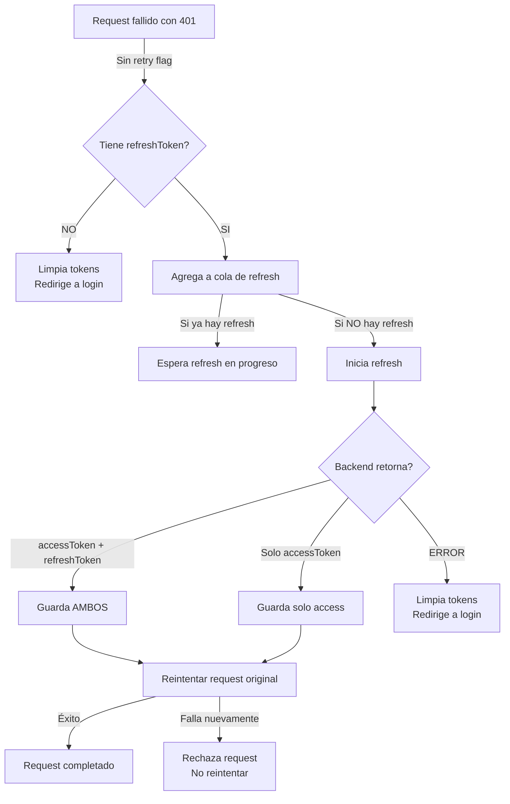

# 🔐 Token Tracking & Debugging Guide

## Problemas Identificados

1. **El refresh token NO se actualiza en localStorage**: Cuando el backend devuelve un nuevo `refreshToken` en la respuesta de refresh, no se guardaba.
2. **Sin prevención de race conditions**: Si múltiples requests fallaban simultáneamente (401), podría haber conflictos.
3. **Sin reintentos limitados**: Podía entrar en bucles infinitos de refresh fallidos.
4. **Falta de visibilidad**: No había forma de rastrear dónde se borraba el token.

---

## Soluciones Implementadas

### 1. **Token Manager** (`src/shared/services/tokenManager.ts`)

Sistema centralizado que:
- ✅ Mantiene un registro de todas las operaciones con tokens
- ✅ Loguea automáticamente cada GET, SET, CLEAR de tokens
- ✅ Previene race conditions en refresh token requests
- ✅ Exporta logs para debugging

**Uso en código:**
```typescript
import { tokenManager } from "@/shared/services";

// Get access token (con logging automático)
const token = tokenManager.getAccessToken();

// Set access token
tokenManager.setAccessToken(newToken);

// Set refresh token
tokenManager.setRefreshToken(newRefreshToken);

// Clear all tokens
tokenManager.clearTokens();

// Ver logs en consola
tokenManager.printLogs();

// Exportar logs como JSON
const logs = tokenManager.exportLogs();
```

### 2. **API Interceptor Mejorado** (`src/shared/services/api.ts`)

Cambios principales:
- ✅ Usa `tokenManager` en lugar de `localStorage` directo
- ✅ **IMPORTANTE**: Ahora actualiza AMBOS tokens cuando el backend devuelve un nuevo refresh token
- ✅ Previene reintentos infinitos con `_retry` flag
- ✅ Usa cola de refres para evitar race conditions
- ✅ Mejores logs de debugging

```typescript
// Antes (❌ NO guardaba nuevo refresh token):
localStorage.setItem("accessToken", newAccessToken);

// Ahora (✅ Guarda ambos):
if (res.data.accessToken) {
  tokenManager.setAccessToken(res.data.accessToken);
}
if (res.data.refreshToken) {
  tokenManager.setRefreshToken(res.data.refreshToken);
  console.log("[API] New refresh token stored");
}
```

### 3. **Auth Service Mejorado** (`src/shared/services/authService.ts`)

- ✅ Usa `tokenManager` en login, logout
- ✅ Manejo seguro de errores en logout
- ✅ Siempre limpia tokens al fallar

### 4. **Hook de Debug** (`src/shared/hooks/useTokenDebug.ts`)

```typescript
import { useTokenDebug } from "@/shared/hooks";

function MyComponent() {
  const { tokenStatus, printTokenLogs, exportTokenLogs, getLogs } = useTokenDebug();

  return (
    <div>
      Access Token: {tokenStatus.hasAccessToken ? "✓" : "✗"}
      Refresh Token: {tokenStatus.hasRefreshToken ? "✓" : "✗"}
      
      <button onClick={printTokenLogs}>Ver logs en consola</button>
      <button onClick={exportTokenLogs}>Descargar logs como JSON</button>
    </div>
  );
}
```

### 5. **Componente Token Debugger** (Opcional)

Interfaz visual para monitorear tokens en tiempo real (solo en desarrollo).

**Habilitar en `.env`:**
```env
VITE_DEBUG_TOKENS=true
```

**Agregar a App.tsx o Layout:**
```typescript
import { TokenDebugger } from "@/shared/components";

export function App() {
  return (
    <>
      <TokenDebugger /> {/* Botón flotante 🔐 */}
      {/* resto del app */}
    </>
  );
}
```

---

## Cómo Usar para Debugging

### **En la Consola del Navegador:**

```javascript
// Ver todos los logs de tokens
tokenManager.printLogs();

// Exportar logs como JSON
const logs = tokenManager.exportLogs();
console.log(logs);

// Ver logs específicos
tokenManager.getLogs().filter(log => log.action === "REFRESH_FAILED");
```

### **En Red Debugger (DevTools > Network):**

1. Abre DevTools → Pestaña **Network**
2. Filtra por `refresh` para ver requests de refresh token
3. Verifica que la respuesta incluya:
   ```json
   {
     "accessToken": "new_access_token_here",
     "refreshToken": "new_refresh_token_here"
   }
   ```

### **En Storage (DevTools):**

1. Abre DevTools → Pestaña **Application**
2. Haz clic en **LocalStorage** → tu dominio
3. Busca: `accessToken` y `refreshToken`
4. Verifica que cambien cuando se llama a refresh

---

## Flujo de Refresh Token Ahora



---

## Checklist: ¿Por Qué Se Borraba el Token?

Usa este checklist para identificar el problema:

- [ ] ¿Se guardaba el nuevo refresh token? **Ahora: SÍ**
- [ ] ¿Había race conditions? **Ahora: NO (usa cola)**
- [ ] ¿Se reinciaba infinitamente? **Ahora: NO (flag _retry)**
- [ ] ¿Se limpiaba en logout? **Ahora: SÍ (siempre)**
- [ ] ¿Se limpiaba en refresh fallido? **Ahora: SÍ (con logs)**
- [ ] ¿Había sincronización entre pestañas? **Parcial (escucha storage events)**

---

## Próximos Pasos (Opcional)

1. **Sincronización entre pestañas:**
   ```typescript
   // Agregar a tokenManager
   private syncWithOtherTabs() {
     window.addEventListener('storage', (e) => {
       if (e.key === 'refreshToken') {
         this.logAction('REFRESH_TOKEN_CHANGED_OTHER_TAB', e.newValue ? 'Updated' : 'Cleared');
       }
     });
   }
   ```

2. **Almacenamiento seguro (SessionStorage):**
   ```typescript
   // Para refresh token (solo durante la sesión)
   sessionStorage.setItem("refreshToken", token);
   
   // Para access token (temporal, nunca en localStorage)
   // Mejor: sessionStorage o memoria
   ```

3. **Rotación automática de tokens:**
   ```typescript
   // Refrescar proactivamente antes de expirar
   const token = jwt_decode(accessToken);
   const expiresIn = token.exp * 1000 - Date.now();
   setTimeout(() => autoRefreshToken(), expiresIn - 60000); // 1 min antes
   ```

---

## Contacto de Issues

Si encuentras problemas:
1. Abre la consola: `tokenManager.printLogs()`
2. Busca en los logs acciones con ERROR
3. Verifica el timestamp cuando se borra el token
4. Compara con requests en la pestaña Network
